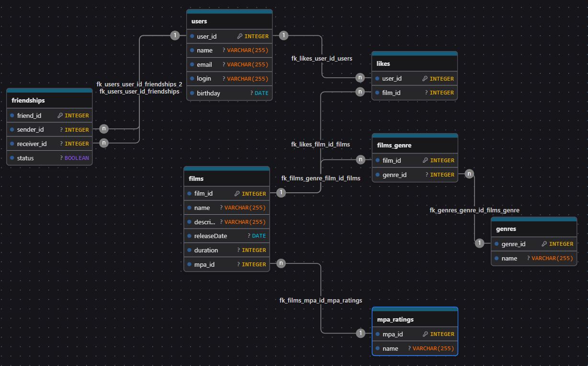

https://www.drawdb.app/editor?shareId=8bf0616653fffa91a85c3a3fd7883da3

Описание:

Схема базы данных построена по принципам нормализации (3НФ) и включает:
Основные сущности (users, films)
Справочники (mpa_ratings, genres)
Связующие таблицы для отношений многие-ко-многим (friendships, likes, film_genre)

Главные особенности:
Жанры реализованы через промежуточную таблицу (у фильма может быть несколько жанров)
Рейтинги MPA - через прямое отношение (у фильма только один рейтинг)
Система друзей поддерживает статусы заявок
Лайки организованы как отдельная связь пользователей и фильмов